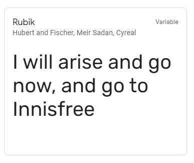

# Wildlife Rescue Dublin

This is a Data Centric web app for a fictional wildlife animal rescue charity.

There are various wildlife charities that rescue or rehabilitate animals whom have been involved in accidents or become ill. Sometimes members of the public find these animals and become their carers.

A part of taking care of the animals is completing paperwork as the animal's care may requires licensing. The aim of this app is to make the process easier. Members of the public can register incident cases and the charity or Governing body can follow up.

## UX

### Scope

This is a fictional charity page, so there are no limitations on the content. The site will be made to an MVP first, and if there is additional time, content/features can be added.

#### User Stories

##### Visitor goals

As a user of this database , I want to be able to register myself a login easily.

As a user of this database , I want to be able to easily capture information on any mobile device.

As a user of this database , I want to edit case records I submitted.

As a user of this database , I want to be able to delete any information I created.

As a user of this database , I want to be able to search and filter results easily.

As a user of this database , I want to be able to edit my contact details.

As a user of this database , I want to be able to upload an image as part of my case.

As a user of this database , I want some of the form fields to autocomplete or auto suggest while i type.

##### Owner goals

As an owner of this database site, I want each case incident to have a unique case number.

As an owner of this database site, I want to be able to have a user with superuser read/write access , this user can have read/write access to all records.

As an owner of this database site, I want to be able to search and filter results easily.

### Structure

This Data centric site is put together with HTML, using the bootstrap framework along with some CSS.

The Database will be done using Python and Flask fronted onto a MongoDB backend.

### Skeleton

The page content is dynamic and composed of Jinja templates which are put together using Python Flask, JavaScript DOM methods are also used to make pages versatile.

#### Website page line up / Flask templates

- Home/index

- Login / Logout

- Register new user

- Profile / My details / Edit my Contact details

- All Cases / My Cases / Search screen / pending cases filter / open Cases filter.

- New Case

- View / Edit / Delete Case

#### Non relational Database tables schema

##### cases table

```
_ID: (auto-generated by MongoDB) ObjectId PRIMARY KEY (Not changeable)
case_number: (auto-generated and used as reference for the case) INTEGER (INDEXED FIELD) (Not changeable)
created_by: (username from logged in session) STRING
date: date
Status: STRING
location: STRING (INDEXED FIELD)
image_url: STRING
species: STRING (INDEXED FIELD)
reason: STRING (INDEXED FIELD)
criminal: (yes/No)
Note and comments: ARRAY of ObjectId (linked to notes table _id field )
```

##### User details table

```
_ID (auto-generated by MongoDB) ObjectId PRIMARY KEY (Not changeable)
full-name : STRING
username :  STRING (Not changeable)
password : STRING (Not changeable)
Phone: STRING
```

##### notes  table

```
_ID (auto-generated by MongoDB) ObjectId PRIMARY KEY (Not changeable)
case_id: ObjectId INDEXED (linked to cases table _id field )
date_time : datetimestamp
note: STRING
```

##### reason  table

```
_ID (auto-generated by MongoDB) ObjectId PRIMARY KEY (Not changeable)
reason: STRING
```

##### species table

```
_ID (auto-generated by MongoDB) ObjectId PRIMARY KEY (Not changeable)
species: STRING
```

##### status table

```
_ID (auto-generated by MongoDB) ObjectId PRIMARY KEY (Not changeable)
status: STRING
```

#### Wireframes


### Surface

#### Colours


Colour are natural and sourced from [a nature photo](https://photos.app.goo.gl/3nmoGsiUrAF82Fns5).

- #FFFFFD Black White - taken from the colour of the feathers of a Grey Heron bird
- #ADCE4B Turmeric - taken from Green river reeds on the River Liffey
- #6C6666 Dove Gray - taken from the colour of the feathers of a Grey Heron bird
- #FEE579 Kournikova  - taken from the colour of the beak of a Grey Heron bird

#### Icons

Bootstrap is used for icons

#### Images

images are sourced from here and here <https://diygarden.co.uk/wildlife/rescue-guide/>

#### Fonts

Font used is Rubik from Google fonts.

  

## Features

### Existing Features

- Pagination on cases results page.
- Autocomplete on certain fields in the new case and edit case screen.
- filtered views on cases results cases
- Visitor can register , login and update their contact details
- Visitor has full CRUD access to each case they create.
- Google places integration on the case location field
- Unique case number generated for each case
- Cloudinary image upload integration case image field
- Each case has a notes journal , so case notes history can be audited.

### Features Left to Implement

- Refactor homepage layout , colours and images
- Change password functionality
- Portal to edit user access
- Firebase Authentication API

## Technologies Used

### Frontend

#### Languages

- HTML
- CSS
- Python
- JavaScript

#### Libraries and Frameworks

- [Bootstrap](https://getbootstrap.com/)
- [Flask](https://flask.palletsprojects.com/en/1.1.x/)
- [Jinja](https://jinja.palletsprojects.com/en/2.11.x/)
- [Werkzeug](https://werkzeug.palletsprojects.com/en/1.0.x/)
- [PyMongo](https://pymongo.readthedocs.io/en/stable/)
- Fonts : [Google Fonts](https://fonts.google.com/)
- Icons : [Bootstrap](https://icons.getbootstrap.com/)

#### Tools

- JSfiddle : I used this online IDE to build and play with [Cloudinary API](https://jsfiddle.net/kenwals/8ze3u4ok/33/) and [Google places API](https://jsfiddle.net/kenwals/gv2oe4dp/8/) before i added them to this project confidently
- [MongoDB compass](https://www.mongodb.com/products/compass): Really handy desktop application for viewing and maintaining my DB.
- Wireframe: [Balsamiq](https://balsamiq.com/)
- IDE: Visual Studio Code (VS Code).
- Version control: Git
- Browser Developer tools : [Google Chrome](https://www.google.com/chrome) for console.logging everything.
- Kanban planner : [Github projects](https://github.com/kenwals/Wildlife-Rescue/projects/1).
- Markdown editor: [Typora](https://typora.io/) was used when appropriate, VS code editor was used for most updates.
- File renaming utility: PowerRename from [PowerToys on Windows 10](https://www.windowscentral.com/how-bulk-rename-your-files-windows-10-powertoys)
- Pomodoro timer : [Tomato Clock](https://chrome.google.com/webstore/detail/tomato-clock/enemipdanmallpjakiehedcgjmibjihj)
- Favicon creator : [favicon.io](https://favicon.io/favicon-generator/)
- Autoprefixer CSS : [Autoprefixer](https://autoprefixer.github.io/)
- Auto formatter for HTML, CSS and JS:  [webformatter](https://webformatter.com/html)
- px to rem convertor : [nekoCalc](https://nekocalc.com/px-to-rem-converter)
- JavaScript linter : [jshint](https://jshint.com/)
- Python linter :  [Pep8 online](http://pep8online.com/)
- markdown linter : markdownlint extension on VS Code.
- Colour names : [Name that color](https://chir.ag/projects/name-that-color/#6195ED)
- Colour swatches : [Coolors](https://coolors.co/)
- [markdown table of contents creator](https://ecotrust-canada.github.io/markdown-toc/)
- [site preview tool](http://ami.responsivedesign.is/)
- [Grammarly](https://chrome.google.com/webstore/detail/grammarly-for-chrome/kbfnbcaeplbcioakkpcpgfkobkghlhen?hl=en)
- [Microsoft Excel](https://www.microsoft.com/en-ww/microsoft-365/excel) : used for slicing and dicing wildlife species list.

## Testing

I tested the site as I went along, manually testing or using automated online testing tools. I focused on getting the site working on a small mobile phone screen first (iPhone 5 simulation on the Chrome Developer tools), and then subsequently all other screen sizes. Print values to terminal was used a lot when working with Python. Consoling to log when working with JavaScript.

===
In this section, you need to convince the assessor that you have conducted enough testing to legitimately believe that the site works well. Essentially, in this part you will want to go over all of your user stories from the UX section and ensure that they all work as intended, with the project providing an easy and straightforward way for the users to achieve their goals.

Whenever it is feasible, prefer to automate your tests, and if you've done so, provide a brief explanation of your approach, link to the test file(s) and explain how to run them.

For any scenarios that have not been automated, test the user stories manually and provide as much detail as is relevant. A particularly useful form for describing your testing process is via scenarios, such as:

1. Contact form:
    1. Go to the "Contact Us" page
    2. Try to submit the empty form and verify that an error message about the required fields appears
    3. Try to submit the form with an invalid email address and verify that a relevant error message appears
    4. Try to submit the form with all inputs valid and verify that a success message appears.

In addition, you should mention in this section how your project looks and works on different browsers and screen sizes.

You should also mention in this section any interesting bugs or problems you discovered during your testing, even if you haven't addressed them yet.

If this section grows too long, you may want to split it off into a separate file and link to it from here.

### Performance Testing

### Bugs encountered on the way

#### Depreciated code warnings

While i was developing this web app. I was seeing DeprecationWarning messages coming up in the terminal log. These warnings were coming up for commands such as count and update.  So all MongoDB commands you see in my app now are using the correct and current PyMongo syntax.

Example warning message:

```
DeprecationWarning: update is deprecated. Use replace_one, update_one or 
update_many instead. mongo.db.cases.update({"_id": ObjectId(case_id)}, { "$set": submit})
```

#### Favicon handling in Python Flask

Favicons was causing errors with flask in the early stages, but i eventually got them working for all devices by experimenting with the format I think Flask expected it to be.

### Known issues

#### Pagination orientation problem

For Pagination , I am using flask-paginate. At the time this project was being developed , this module didn't appear to support Bootstrap5 . So I have had to configure it to Bootstrap4. I uses CSS to hide a "Current Page" label section that was looking off. A Bootstrap offset container is also used as i was unable to center allign the pagination otherwise.

### Project barriers and solutions

MongoDB verses PyMongo

When trying to make the case number increment based on code i read in the MongoDB manual, i couldn't get it working in my Python code. Googling the answer wasn't always leading me to the bottom of the problem, as I didn't realise PyMongo has a different syntax then MongoDB. But then i read [this article](https://stackoverflow.com/questions/17054494/pymongo-inc-having-issues/17054663). Hereby learning that PyMongo is slightly different from MongoDB!. So after this , i was back and forth between the two documentation sites , any useful MongoDB commands i needed to use i had to translate to PyMongo .

### Version control

For version control, I used the UI on VS Code for making git commits or the GitHub desktop app, Merging was done on the GitHub site. I used branches when I was working on new features or bundles of changes.

### Functionality Testing

Page 1 - Home page

Page 2 - Case List Page

Page 3 - New Case Page 

Page 4 - View/Edit Case Page

Page 5 - Profile Page

Page 6 - Login Page

Page 7 - Register Page

Page 8 - 404 error Page

### Responsiveness Testing

For this test, I got a list of [15 most common screen sizes](https://www.designrush.com/trends/website-dimensions) and used [http://responsivetesttool.com/](http://responsivetesttool.com/) to check responsiveness for each screen size.

The results are below. 14 Passes and 1 Fail.

| Device category | Model                 | Size Px (%popularity) | Result |
| --------------- | --------------------- | ------------------ | ------ |
| Desktop/Laptop  | NA                    | 1366x768 (22.98%)  | Pass   |
| Desktop/Laptop  | NA                    | 1920x1080 (20.7%)  | Pass   |
| Desktop/Laptop  | NA                    | 1536x864 (7.92%)   | Pass   |
| Desktop/Laptop  | NA                    | 1440x900 (7.23%)   | Pass   |
| Desktop/Laptop  | NA                    | 1280x720 (4.46%)   | Pass   |
| Mobile Phone    | Samsung Galaxy Note 4 | 360x640 (18.7%)    | Pass   |
| Mobile Phone    | Apple iPhone 6        | 375x667 (7.34%)    | Pass   |
| Mobile Phone    | Apple iPhone XR       | 414x896 (6.76%)    | Pass   |
| Mobile Phone    | Samsung Galaxy S8     | 360x780 (5.31%)    | Pass   |
| Mobile Phone    | Apple iPhone X        | 375x812 (5.01%)    | Pass   |
| Tablet          | Apple iPad            | 768x1024 (51.43%)  | Pass   |
| Tablet          | unknown               | 1280x800 (7.28%)   | Pass   |
| Tablet          | Samsung Galaxy Tab    | 800x1280 (5.26%)   | Pass   |
| Tablet          | Google Nexus 7        | 601x962 (4.32%)    | Pass   |
| Tablet          | unknown               | 962x601 (2.99%)    | Fail   |

### CSS3 validator


### HTML5 validator

Home 


Cases list


New Case


View/Edit case


Profile


Login


Register


404 page


### Python validator 

no issues. results below. Resource:  <https://pep8online.com//>


### JavaScript validator

no issues. results below. Resource:  <https://jshint.com/>

static\js\case-date-cut-off.js

```js

Metrics
There is only one function in this file.

It takes one argument.

This function contains 4 statements.

Cyclomatic complexity number for this function is 3.

```

static\js\case-edit.js

```js

Metrics
There are 2 functions in this file.

Function with the largest signature take 0 arguments, while the median is 0.

Largest function has 7 statements in it, while the median is 4.5.

The most complex function has a cyclomatic complexity value of 1 while the median is 1.

```
static\js\cloudinary.js

```js

Metrics
There are 2 functions in this file.

Function with the largest signature take 2 arguments, while the median is 1.

Largest function has 3 statements in it, while the median is 2.

The most complex function has a cyclomatic complexity value of 4 while the median is 2.5.

```

static\js\google-places.js

```js

There are 2 functions in this file.

Function with the largest signature take 0 arguments, while the median is 0.

Largest function has 3 statements in it, while the median is 2.5.

The most complex function has a cyclomatic complexity value of 2 while the median is 1.5.

One unused variable
3	initAutocomplete

```

static\js\profile-edit.js

```js

Metrics
There are 2 functions in this file.

Function with the largest signature take 0 arguments, while the median is 0.

Largest function has 3 statements in it, while the median is 2.5.

The most complex function has a cyclomatic complexity value of 1 while the median is 1.
```

### Usability Testing

I shared the project on the peer-review channel on slack, and also with friends/family. There were several problems highlighted to me which I have since fixed. Such as responsiveness to device screen width size and issues with timer.

I tested and improved accessibility with lighthouse and Firefox developer tools.

### Compatibility Testing

| Screen size\Browser                          | Chrome | Firefox | Edge |
| -------------------------------------------- | ------ | ------- | ---- |
| Android Mobile phone (Screen width 412px) xs | Pass | Pass | Pass |
| Android Tablet (Screen width 600px) sm       | Pass | Pass | Pass |
| Windows laptop (Screen width 2560px)         |   Pass |  Pass |  Pass    |

### Testing User Stories

#### Visitor Stories

#### Owner Story

## Deployment

For easy deployment on Heruko.com , you will need a GitHub user account and possibly a Gitpod user account. If you wish to make changes to this repository, please follow the GitHub steps first.

**Please note** this project contains several restricted APIs that will not work outside of this project without you refactoring in your own keys. Please check the current documentation for each API listed below.

- [MongoDB](https://www.mongodb.com/)
- [Google Places](https://developers.google.com/maps/documentation/places/web-service/overview)
- [Cloudinary](https://cloudinary.com/)

### GitHub

GitHub is a code hosting platform for version control and collaboration. It's free to enrol for a user account and I would recommend you have one if you wish to deploy this repository and make changes.

When you have a GitHub account you can simply click on the Fork button on the top right corner. This will clone the Wildlife-Rescue repository for your GitHub account, then you can make any changes you like.

### Gitpod

The site can be edited easily on a Gitpod online workspace, you first register a free user account on <http://gitpod.io/>, then download the Gitpod extension on your preferred internet browser. On signing up you will be expected to have a GitHub user account.

Once you have the extension on your browser, a green Gitpod button will appear beside this repository in GitHub. For best results fork the repository in your personal account before you open it in Gitpod.

### Heruko

Heruko is a cloud platform that can hosts dynamic web applications.Once you have the completed site in your own repository, you can deploy it to Heruko by the following steps.

1. Before you setup Heruko , you first need to create some files that are necessary for it to run on the Heruko server.
2. Open a terminal window in your IDE on the root folder of the project, run the command below, this will create a new file called procfile.

    `` echo web: python run.py > Procfile ``

3. Now run the command line below. this will create a new file called requirements.txt

    `` pip3 freeze --local > requirements.txt ``

4. Create a [Heruko user account](https://signup.heroku.com/login)
5. Click on the New button and choose Create a new app.
6. Input an app name and choose a region that is closest to you.
7. To input the necessary environmental variables, simply go to Settings tab, and under Config Vars, Click on Reveal Config Vars
8. Now you can deploy, the simplest way is to deploy from github, Click on the Deploy tab, Under Deployment method click on Github. A search window will prompt you to connect to the appropriate repository. You can then choose to do a manual or automatic deployment.

### Local Deployment

If you prefer working on the repository locally on your preferred Desktop IDE, you can clone the repository to your desktop by the following steps.

1. Go to [the wildlife-rescue github page](https://github.com/kenwals/Wildlife-Rescue).
2. Above the list of files, click on the **code** button.
3. To clone the repository using **HTTPS,** under "Clone with HTTPS", click the paste icon.
   To clone the repository using an **SSH key**, click Use SSH, then click the paste icon.
   To clone a repository using **GitHub CLI,** click Use GitHub CLI, then click the paste icon.
4. Open your preferred Terminal interface.
5. Change the current working directory to the location where you want the cloned directory.
6. Type **git clone**, then paste the URL you copied earlier above.
7. Press Enter to create your local clone.
8. To run the app.py locally you will need to have a mongoDB account, with the supporting variables inputted in the env.py file,
 you may also need to install the packages listed Python app file.

more detailed instructions available [here](https://docs.github.com/en/free-pro-team@latest/github/creating-cloning-and-archiving-repositories/cloning-a-repository)

### Forking

You may wish to contribute to this website and have your contribution published, if so, you are welcome to follow these steps below.

1. Go to the GitHub website and log in.
2. Open <https://github.com/kenwals/Wildlife-Rescue>
3. In the top right-hand corner you will see a fork button, click on this **Fork button**.
4. This will create a copy of the Wildlife-Rescue repository in your Github account.
5. Once you're finished making changes you can locate the **New Pull Request** button just above the file listing in the original repository (<https://github.com/kenwals/wildlife-rescue>).
6. If your pull request is approved, it will be merged into the master version of the Wildlife-rescue repository at a future date.

more detailed instructions available [here](https://docs.github.com/en/free-pro-team@latest/github/getting-started-with-github/fork-a-repo)

## Credits

### Content

- The foundation of this site is sourced from Code Institute Educational material - [Tim Nelson's Task Manager project](https://github.com/TravelTimN/flask-task-manager-project/tree/demo).
- Homepage text was sourced from [DIY Garden rescue guide](https://diygarden.co.uk/wildlife/rescue-guide/)
- Homepage text, lists of species, reasons, and statuses were sourced from [wildlife incidents app](https://wildlife-incidents.com/)

### Resources

- Method for getting autocomplete working on the forms was based on [this article](https://gomakethings.com/how-to-create-a-form-input-autocomplete-without-a-library-or-framework/)

- The pagination code is taken and refactored from [here](https://github.com/smoodydev/flaskpaginate), it had been mentioned on slack by Ed.

- The method i used for making Case and profile pages read only was based on [this article](https://stackoverflow.com/questions/3507958/how-can-i-make-an-entire-html-form-readonly)

- [Cloudinary Widget info](https://cloudinary.com/documentation/upload_widget#api_events)

- [Bootstrap components](https://getbootstrap.com/)

- [W3schools](https://www.w3schools.com/)

- [Code institute's Slack workspace channels](https://slack.com)

- [Stack Exchange](https://stackexchange.com/)

- [MDN Web Docs](https://developer.mozilla.org/en-US/)

### Media

- Images on front page are sourced from [here](https://diygarden.co.uk/wildlife/rescue-guide/) and [here](https://unsplash.com/photos/b027q9eF3Yo)

### Acknowledgements

- I received inspiration for this project from Feargal Timon at <https://wildlife-incidents.com/> and Galway swan rescue.
- Kudos to Ed Bradly for his excellent advice and tips on #data-centric-dev Slack channel and on the recorded zoom call from March.
- My Mentor [Maranatha Ilesanmi](https://github.com/mbilesanmi)
- Code Institute's [Tim Nelson](https://github.com/TravelTimN/) who gave me some useful pointers with this project.
